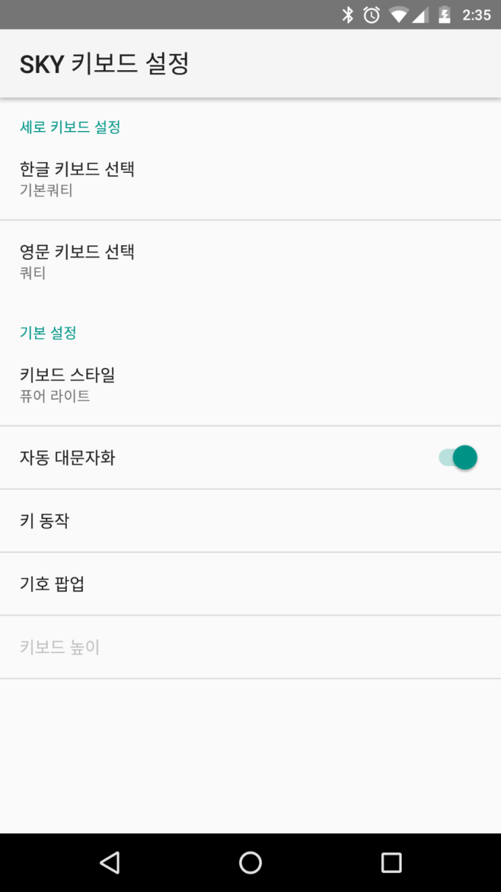
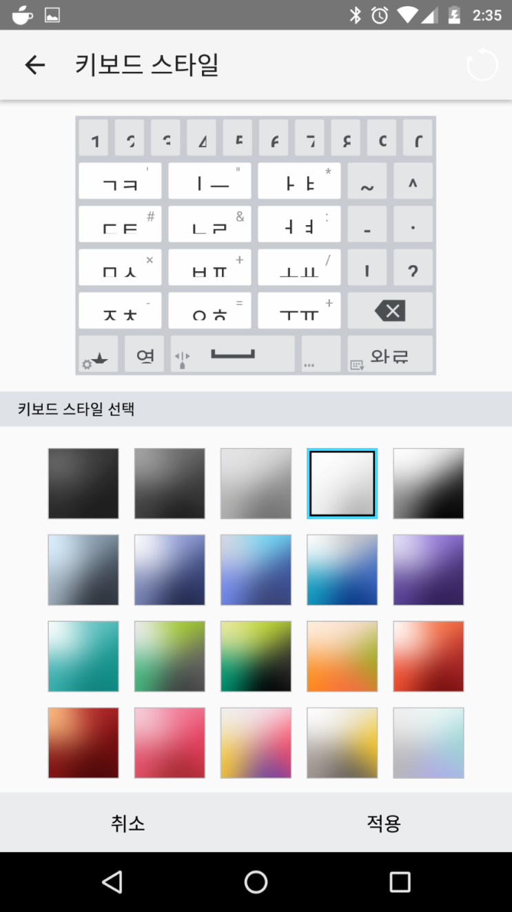

# Pantech IM-100 Keyboard Port for Android 6.0+

</img>
</img>

팬택 IM-100 (2016) 기기에 선탑재된 기본 키보드 애플리케이션을
Android 6.0 이상의 모든 기기에서 이용할 수 있도록 포팅한 자료입니다.

# HOW TO

- <a href="https://github.com/yymin1022/IM-100_Keyboard/releases">Release 페이지</a> 에서 Latest 태그로 업로드된 2개의 apk를 다운로드한 뒤 기기에 설치합니다.

# Known Problems

- 키보드 클릭시 소리/진동 반응 기능이 비활성화됩니다.

- 특정 상황에서 키보드 높이 조절 기능이 비활성화됩니다.

- Android 9 이상의 OS에서 키보드가 보이지 않습니다.

***

### 배포 내역
* 2016\. 07\. 개발 시작
* 2016\. 08\. V1\.0 배포